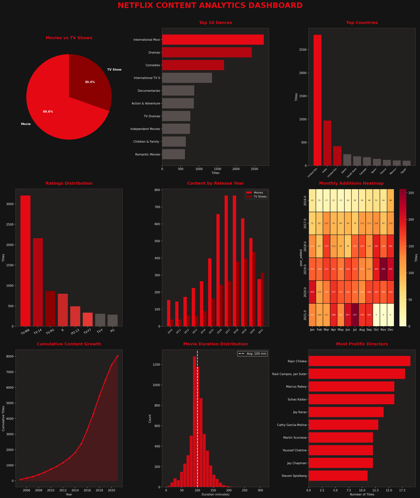

# netflix-data-analysis
End-to-End Netflix Content Data Analysis Project
#  Netflix Content Data Analysis

End-to-end exploratory data analysis of Netflix's content library.

## Dataset
- Source: [Kaggle - Netflix Movies and TV Shows](https://www.kaggle.com/datasets/shivamb/netflix-shows)
- 8,807 titles | 2008–2021 | 12 columns

##  Analysis Areas
- ✅ Content Type Distribution (Movies vs TV Shows)
- ✅ Genre & Content Trends
- ✅ Country-wise Distribution
- ✅ Audience Ratings Analysis
- ✅ Year-over-Year Growth Trends

##  Tools Used
- Python (Pandas, Matplotlib, Seaborn)
- Google Colab
- Excel Dashboard
- PowerPoint Presentation

##  Files
| File | Description |
|------|-------------|
| `Netflix_Analysis.py` | Main Python analysis script |
| `netflix_titles.csv` | Dataset |
| `netflix_dashboard.png` | 9-chart visualization |
| `Netflix_Analysis_Dashboard.xlsx` | Excel dashboard |
| `Netflix_Analysis_Report.pdf` | Full PDF report |
| `Netflix_Presentation.pptx` | PowerPoint slides |

## How to Run
```bash
pip install pandas numpy matplotlib seaborn
python Netflix_Analysis.py
```

## Dashboard Preview

